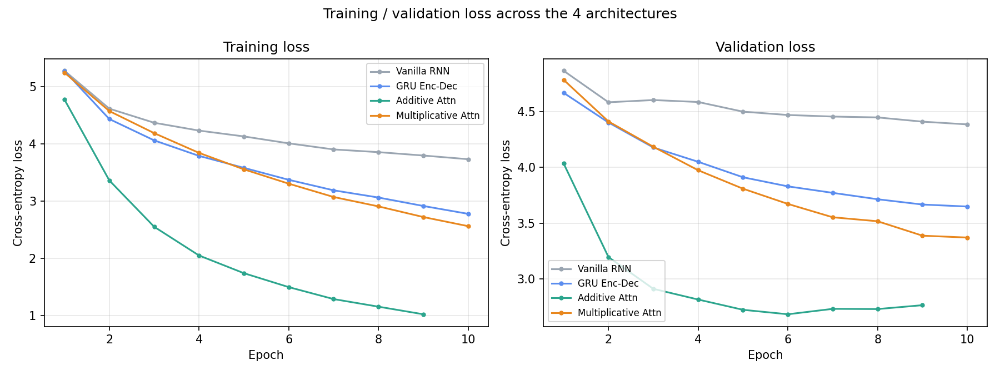
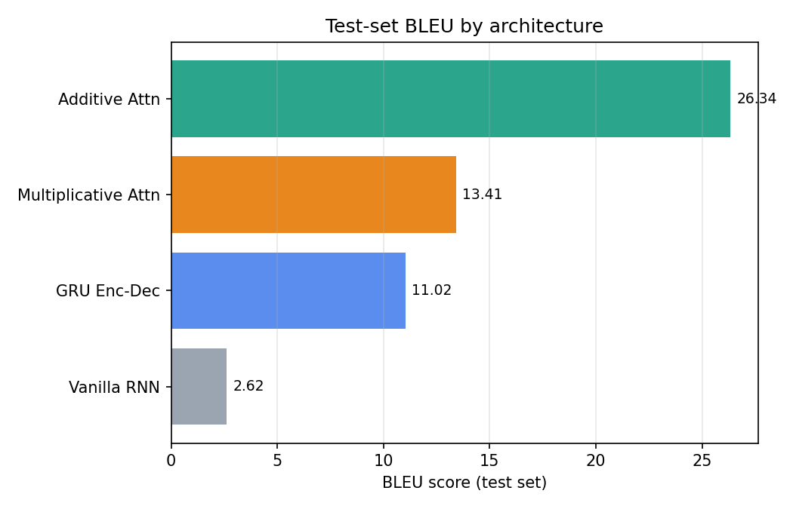

# Comparative Analysis of Machine Translation Models

**Course:** Artificial Intelligence (AI), BCT 2080, Advanced College of Engineering and Management (ACEM), Tribhuvan University
**Student:** Arjita | Roll No. ACE080BCT015 | 6th Semester, Computer Engineering
**Assignment:** Lab 10 (A1) — Comparative Analysis of Machine Translation Models

## Overview

This project implements and compares four neural machine translation (NMT) architectures on the same English→French translation task:

1. **Vanilla RNN Seq2Seq** — a single-layer plain RNN encoder-decoder with no gating and no attention.
2. **GRU Encoder-Decoder** — the same encoder-decoder shape, but with GRU cells (gating) instead of a plain RNN. Still no attention, so the whole source sentence is compressed into one fixed-length context vector.
3. **Encoder-Decoder + Additive (Bahdanau) Attention** — a bidirectional GRU encoder whose outputs at *every* time step are kept, plus an additive/MLP-style attention mechanism so the decoder can look back at different parts of the source sentence at each generation step.
4. **Encoder-Decoder + Multiplicative (Luong) Attention** — same idea as (3), but the alignment score between decoder and encoder states is a bilinear/dot-product ("multiplicative") operation instead of a small feed-forward network, computed *after* the decoder's recurrent step rather than before.

All four models are trained from scratch (no pretrained embeddings) under identical data, splits, and hyperparameters so the only thing that changes between runs is the architecture itself.

> **Note on the "RNN" vs. "Encoder-Decoder" naming in the assignment:** since every encoder-decoder model is technically built from RNN cells, Model 1 is implemented with plain (`nn.RNN`, tanh) cells to represent "RNN" specifically, while Models 2–4 use GRU cells, which is the standard choice for encoder-decoder NMT. This lets the comparison isolate two effects: gating (Model 1 → Model 2) and attention, additive vs. multiplicative (Model 2 → Models 3/4).

## Dataset

- **Source:** [ManyThings.org / Anki bilingual sentence pairs](https://www.manythings.org/anki/) — `fra-eng.zip` (English–French, Tatoeba Project derived, CC-BY 2.0 France).
- The raw file ships as `English<TAB>French<TAB>attribution` and is **not** committed to this repo (see `.gitignore`); `src/preprocess.py` expects it at `data/raw/fra.txt`.
- **Preprocessing** (`src/preprocess.py`):
  - Lowercased, punctuation split off as its own token, everything outside `[a-z À-ÿ . ! ? ,]` stripped.
  - Filtered to sentence pairs with 2–12 words on both sides, to keep training tractable on a CPU.
  - De-duplicated, then a fixed-seed random subsample of **20,000 pairs** is used for the whole experiment.
  - Split **80 / 10 / 10** into train / validation / test.
  - Word-level vocabularies are built from the **training split only** (no leakage from val/test), with a minimum frequency of 2; rarer words map to `<unk>`.

## Reproducibility

Per the assignment instructions, `random_state = <roll number>`. My roll number is **ACE080BCT015**; I concatenated its digit groups (`080` + `015`) to get a numeric seed: **`random_state = 80015`**. This single seed (`src/config.py: RANDOM_STATE`) drives the dataset subsampling/splitting and all model weight initialization, so results are reproducible from a clean checkout.

## Repository structure

```
.
├── data/
│   ├── raw/                # fra.txt goes here (not committed — see Setup)
│   └── processed/          # cached cleaned pairs + vocabularies (data.pkl)
├── src/
│   ├── config.py           # all hyperparameters + the random seed
│   ├── preprocess.py       # cleaning, filtering, vocab building, splitting
│   ├── dataset.py          # PyTorch Dataset / DataLoader / collate_fn
│   ├── train.py            # training loop shared by all 4 models
│   ├── evaluate.py         # BLEU scoring + sample translations
│   ├── utils.py            # seeding, timing, small helpers
│   └── models/
│       ├── rnn_seq2seq.py             # Model 1
│       ├── encoder_decoder.py         # Model 2
│       ├── attention_additive.py      # Model 3
│       └── attention_multiplicative.py# Model 4
├── checkpoints/            # best model weights per architecture (generated)
├── results/
│   ├── metrics/            # per-model loss history + comparison.csv
│   ├── plots/              # loss curves, BLEU comparison chart
│   └── translations/       # qualitative sample translations per model
├── run_experiment.py       # single CLI entry point (preprocess / train / evaluate / all)
├── translate.py            # small CLI demo to translate a sentence with a trained model
├── requirements.txt
└── report/                 # research-article style writeup (see report/)
```

## Setup

```bash
git clone <this-repo-url>
cd nmt-comparative-analysis
python -m venv .venv && source .venv/bin/activate   # optional but recommended
pip install -r requirements.txt
python -c "import nltk; nltk.download('punkt')"       # only needed once, for BLEU tokenization helpers
```

Download the dataset (not included in the repo) and place it under `data/raw/`:

```bash
curl -O https://www.manythings.org/anki/fra-eng.zip
unzip fra-eng.zip -d data/raw/
# should now have data/raw/fra.txt
```

## Reproducing the experiment

```bash
python run_experiment.py preprocess   # build data/processed/data.pkl (deterministic, seed=80015)
python run_experiment.py train        # trains all 4 models, saves best checkpoint per model
python run_experiment.py evaluate     # BLEU on held-out test set + sample translations + comparison.csv
```

Or train a single architecture: `python run_experiment.py train --model additive_attention`.

Try a trained model interactively:

```bash
python translate.py --model additive_attention "i love machine translation"
python translate.py --model additive_attention --interactive
```

## Results

See `results/metrics/comparison.csv` and `results/plots/` for the full numbers and plots. Summary (test-set BLEU, 2,000 held-out sentence pairs, greedy decoding):

| # | Model | BLEU | Inference speed (sent/s) |
|---|-------|-----:|--------------------------:|
| 1 | Vanilla RNN Seq2Seq (no attention) | 2.62 | 2895.6 |
| 2 | GRU Encoder-Decoder (no attention) | 11.02 | 2340.9 |
| 3 | Encoder-Decoder + Multiplicative (Luong) Attention | 13.41 | 1896.5 |
| 4 | Encoder-Decoder + Additive (Bahdanau) Attention | **26.34** | 712.7 |




**Takeaways:**

- Gating alone (Model 1 → Model 2, plain RNN → GRU) more than **quadruples** BLEU, confirming that vanishing gradients / limited memory are a real bottleneck for the vanilla RNN on even fairly short (≤12-word) sentences.
- Attention (Model 2 → Models 3/4) gives another large jump, because the decoder no longer has to compress the whole sentence into a single fixed-length vector — it can look back at the relevant source words directly.
- The additive-attention model outperforms the multiplicative one here, but the comparison isn't perfectly isolated: the additive model uses a **bidirectional** encoder (as in Bahdanau et al.) while the multiplicative model uses a **unidirectional** encoder (as in Luong et al.), matching each paper's original design. Some of the additive model's advantage is therefore likely coming from the bidirectional encoder having access to right-context, not purely from the attention scoring function. This trade-off is discussed further in the report.
- Unsurprisingly, the extra attention computation makes inference slower — the additive model translates the test set at roughly a quarter of the vanilla RNN's throughput.

Full discussion of these results (why attention helps, where each model breaks down, qualitative error analysis, and the encoder-direction caveat above) is in the report under `report/`.

## Acknowledgements

- Dataset: [ManyThings.org/Anki](https://www.manythings.org/anki/) (sentence pairs from the [Tatoeba Project](https://tatoeba.org/), CC-BY 2.0 France).
- Architectures follow Sutskever et al. (2014) *Sequence to Sequence Learning with Neural Networks*, Bahdanau et al. (2015) *Neural Machine Translation by Jointly Learning to Align and Translate*, and Luong et al. (2015) *Effective Approaches to Attention-based Neural Machine Translation*.
- Implemented in PyTorch as part of the AI course (BCT 2080) assignment at ACEM. I used an AI assistant (Claude) to help design/debug the training pipeline and draft documentation, as permitted by the assignment instructions; all experiments were run and results verified by me.
